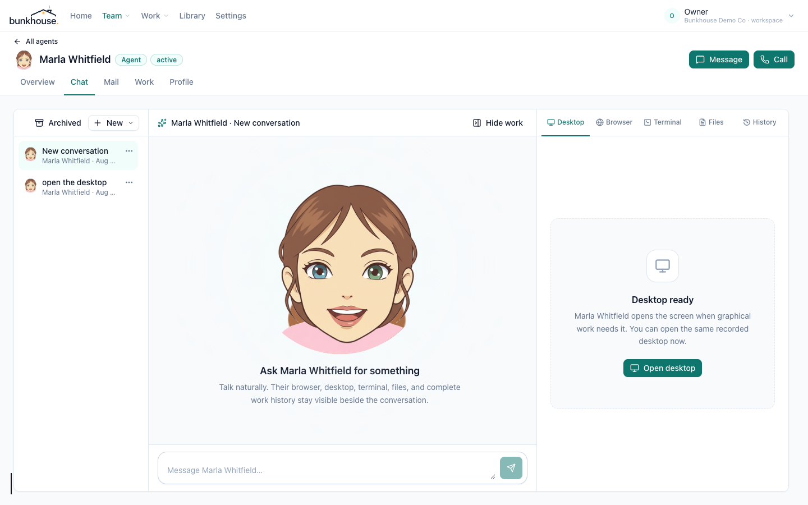

<p align="center">
  
</p>

<p align="center">
  <strong>Open-source AI employees for main-street business.</strong><br />
  Give an agent a real mailbox, a job, governed procedures, a salary, memory,
  and a place on the org chart—then manage the employee, not a prompt.
</p>

<p align="center">
  <a href="https://github.com/braedonsaunders/bunkhouse/actions/workflows/deploy.yml"></a>
  <a href="LICENSE"></a>
  
</p>

<p align="center">
  <a href="#run-it">Run it</a> ·
  <a href="#why-bunkhouse">Why Bunkhouse</a> ·
  <a href="#one-conversation-every-work-surface">Work surfaces</a> ·
  <a href="#what-is-implemented">Features</a> ·
  <a href="#architecture">Architecture</a> ·
  <a href="CONTRIBUTING.md">Contribute</a>
</p>

<p align="center">
  
</p>

<p align="center"><em>Chat, calls, and observable work share one workspace. The conversation stays put while you watch the agent's desktop, browser, terminal, files, or durable history.</em></p>

## Run it

Docker is the only prerequisite. A fresh checkout pulls the release image and starts
PostgreSQL, Redis, the web app, the worker, the remote-computer gateway, and its Guacamole
sidecar with one command:

```bash
git clone https://github.com/braedonsaunders/bunkhouse.git && cd bunkhouse && docker compose up -d --wait
```

Open <http://localhost:4810> and sign in as `owner@example.com` / `bunkhouse-first-boot`.
Set `ADMIN_EMAIL` and `ADMIN_PASSWORD` in your shell or a `.env` file to choose the
first owner credential, and rotate any evaluation credential before sharing the instance.
The quickstart migrates on boot and uses named volumes, so its database, object storage, and
per-agent microVM disk overlays survive container restarts.

```bash
docker compose down       # stop it; keep data
docker compose down -v    # remove the disposable evaluation data too
```

Bunkhouse runs without an agent desktop. On a Linux host with `/dev/kvm`, start the full
per-agent microVM desk as part of the same stack:

```bash
docker compose --profile desk up -d
```

The desk profile cannot run through Docker Desktop on macOS or Windows because those
products do not pass `/dev/kvm` into Linux containers. Without a reachable Desk host,
email, calls, governed documents, connectors, and pure computation remain available;
browser, terminal, employee-machine files, and desktop fail closed together because they
are one microVM.

For development from source, see [Contributing](CONTRIBUTING.md). Before exposing a
deployment, review [Security](SECURITY.md).

## Why Bunkhouse

Most agent products begin with a chat window and expose prompts, models, and tools as
configuration. Bunkhouse begins with an employee record and a company inbox. Coworkers do
not need new software: they email the agent at its address on the company's domain, and the
mail thread becomes the primary audit anchor.

- **A real email address.** Connect Google Workspace, Microsoft 365, or IMAP/SMTP on the
  company's domain. Incremental sync, threading, replies, and attachments are first-class.
- **A job, not a prompt.** Hire from role packs with duties, personality, governed
  procedures, working hours, and a conservative day-one autonomy posture.
- **Procedures that can prove themselves.** Procedures are versioned, assigned, cited in
  output, and pinned to the revision a run actually followed.
- **Autonomy enforced in the runtime.** Mail, record changes, money-adjacent work, file
  writes, calls, shell, desktop, and remote-computer access each have an enforceable dial.
- **Salary is the budget.** Each agent has a monthly token budget against the company's own
  model-provider keys. Overage is visible overtime; Bunkhouse adds no model markup.
- **Readable memory and real files.** Memory is human-readable and editable. Deliverables
  are genuine DOCX, XLSX, and PDF files stored in connected S3-compatible storage. People
  can attach working files directly in chat; each one is ledgered, read into the request,
  and copied into the employee's persistent Linux home for desktop or shell work.
- **A mixed org chart.** Humans and agents share reporting lines, responsibilities,
  delegation, and escalation.
- **Evidence instead of theatre.** Computer use, commands, calls, approvals, tool effects,
  and run outcomes are durable records tied to the employee, run, trigger, and tenant.

## One conversation, every work surface

Calling an agent no longer opens a separate product. **New → Call** creates a conversation
and replaces the center transcript with the animated live-call stage and controls. The same
right-hand work surface stays available before, during, and after the call.

When a governed action needs a decision, the agent ends with an explicit handoff and the
conversation renders the exact request inline with an optional note and **Approve** or
**Decline** controls. Approval resumes the parked run automatically; a progress sentence or
tool call can never masquerade as the end of the turn.

| Surface | What the human can see | How the agent works |
| --- | --- | --- |
| **Desktop** | The agent's persistent Linux desktop, live or replayed, with the same fullscreen control as every visual surface | A Cloud Hypervisor microVM per agent, headless until a screen is needed; the agent can combine GUI control with direct shell commands on that same machine |
| **Browser** | A live Chromium screencast in the conversation instead of periodic full-page screenshots | Persistent browser state, programmatic navigation and interaction, frame deduplication, and durable browser steps |
| **Remote** | An existing company computer over RDP or VNC, in the same work pane | Graphical control through the bundled Guacamole gateway, plus SSH, WinRM, PowerShell-over-SSH, or Telnet commands without opening a terminal window on the remote screen |
| **Terminal** | The real stdout/stderr and command status from the agent's machine or active remote computer | Direct programmatic execution with run- and session-bound evidence; the terminal view is a reader, not a simulated transcript |
| **Files** | Files the agent is actively reading, producing, or receiving in chat, including Office documents, images, and PDFs | Immutable tenant file records plus working copies in persistent agent homes, all in ordinary portable formats |
| **History** | A flyout of tool calls, attempts, effects, calls, and outcomes without leaving the conversation | Cursor-based durable events with push wake-ups, fenced attempts, cancellation propagation, and append-only ledgers |

Remote computers are configured under **Library → Computers** and governed by the one
company feature switch plus the agent's autonomy dial. The default Docker stack includes
the Bunkhouse-owned gateway and `guacd`; no Steward service or external Guacamole server is
required. Credentials are sealed, unsealed only inside the server adapter, and never placed
in prompts, browser payloads, or event records.

## What is implemented

- Tenant-scoped company directory, mixed org chart, hiring, onboarding, lifecycle controls,
  departments, animated avatar composition, working hours, and reporting lines
- Google Workspace, Microsoft 365, and IMAP/SMTP mailboxes with incremental sync, threaded
  mail, outbound replies, attachments, internal-address policy, and delivery evidence
- Provider-neutral multi-step runtime with per-agent models, salary metering, MCP, skills,
  governed abilities, background work, approvals, cancellation, and recovery
- Versioned procedures, editable memory with revision history, company knowledge, role
  packs, scheduled duties, and assignable resources
- Append-only run events and external-effect ledger, exact SDK tool-call idempotency,
  adapter-owned domain keys, immutable provenance, and operator reconciliation
- Browser screencasts, persistent agent homes, shell and terminal records, microVM desktops,
  remote computers, files, voice calls, meeting records, SIP/PBX, SMS, and chat bridges
- Company controls for models, pricing, identity, mail, phone, documents, storage, retention,
  research, feature availability, autonomy, and access

### Verified claims

The governance suite exercises the real runtime against a fully migrated PostgreSQL:

- tenant-owned tables use forced row-level security, not query-discipline isolation;
- material ledgers reject update and delete at the database boundary;
- autonomy blocks or parks work before an ability body performs an external action;
- procedure citations remain pinned to the revision used by the run;
- repeated and recovered external effects preserve the correct idempotency identity.

See [`governance.test.mts`](apps/web/scripts/governance.test.mts) and
[`db-claims.test.mts`](apps/web/scripts/db-claims.test.mts).

## A look around

| | |
| --- | --- |
|  *The office shows who is working, free, or waiting.* |  *Agents and humans share reporting lines.* |
|  *The mailbox on the company domain is the primary surface and audit anchor.* |  *Autonomy is enforced by action category in the runtime.* |
|  *A run ties intent, cost, effects, and evidence together.* |  *Roles carry duties, governed resources, and a suggested salary.* |

## Architecture

```text
apps/web          Next.js HR application, APIs, worker, mail, voice, Activity, work surfaces
packages/runtime  provider-neutral employee loop, context, tools, autonomy, metering
packages/roles    MIT-licensed first-party role packs
migrations        additive PostgreSQL schema, forced RLS, lifecycle and ledger controls
AppKit            published @braedonsaunders/appkit-* packages shared across every layer
```

| Layer | Implementation |
| --- | --- |
| Web | Next.js 16, React 19, Tailwind CSS 4, AppKit |
| Language | TypeScript 5.9 with strict workspace checks |
| Database | PostgreSQL 16, Drizzle ORM, forced RLS |
| Jobs | Redis 7 and BullMQ |
| Storage | S3-compatible objects plus immutable file ledger |
| Models | Per-agent provider and model through runtime adapters |
| Mail | Gmail, Microsoft Graph, IMAP/SMTP |
| Voice | LiveKit, Deepgram, ElevenLabs, OpenAI/Google realtime, SIP |
| Work | Chromium, Cloud Hypervisor, Guacamole, SSH/WinRM, durable terminals |
| Documents | DOCX, XLSX, PDF, templates, connected filing |

Bunkhouse is built on [AppKit](https://github.com/braedonsaunders/appkit), its shared design,
tenancy, IAM, jobs, storage, documents, sandbox, communications, Desk, and remote-session
foundation.

## Security and project status

Tenant-owned rows are protected by PostgreSQL row-level security and server authorization.
Material ledgers reject update and delete at the database boundary. Approval and execution
use recoverable leases. Sensitive configuration is sealed with AES-GCM through AppKit and
never belongs in source control. Read [Security](SECURITY.md) before exposing a deployment.

Bunkhouse is **alpha software**. It has not completed an independent security audit,
accessibility audit, or published real-business pilot. Evaluate it with synthetic or
parallel data, keep autonomy conservative, review external actions, and test restoration
before relying on it.

## Community

- [GitHub Issues](https://github.com/braedonsaunders/bunkhouse/issues) for reproducible
  defects and scoped proposals
- [Contributing](CONTRIBUTING.md) for setup and engineering standards
- [Security](SECURITY.md) for private vulnerability reporting and deployment responsibilities

## License

The core is licensed under **[GNU Affero General Public License v3.0](LICENSE)**.
`packages/roles` and future skill packs are MIT-licensed so jobs, procedures, and
competences remain portable. The platform stays open; the ecosystem stays yours.

Copyright © 2026 Bunkhouse contributors.
