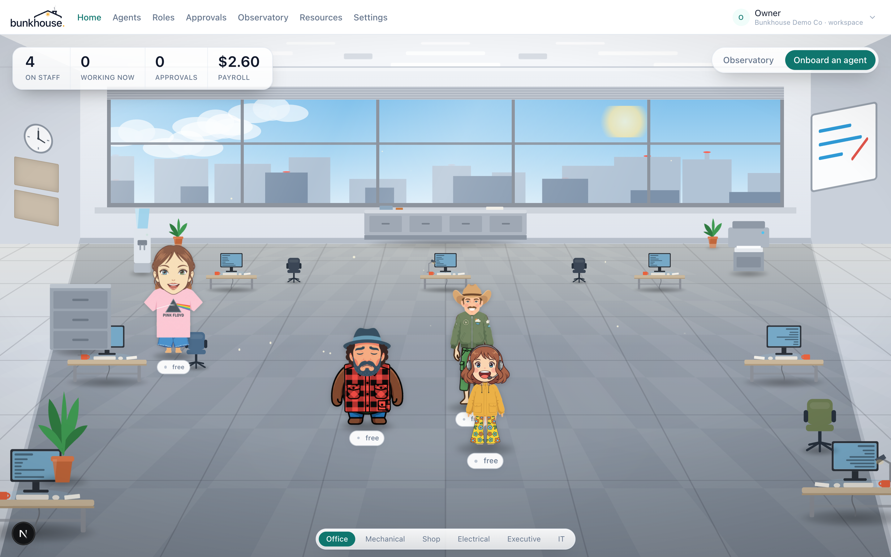
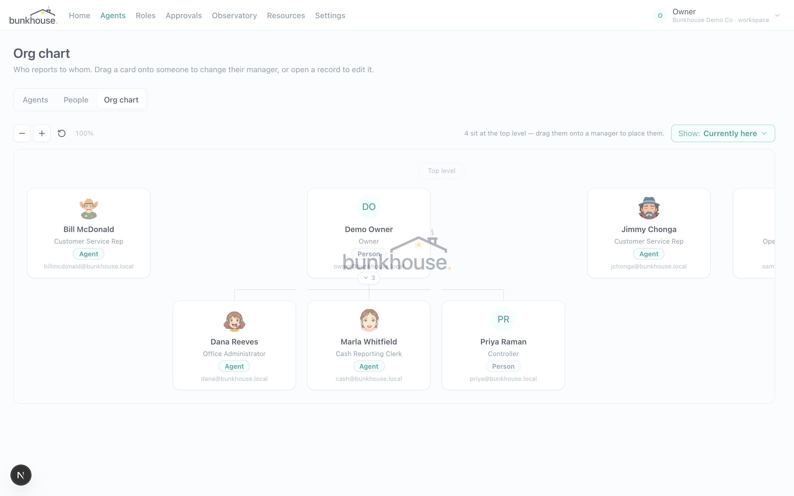
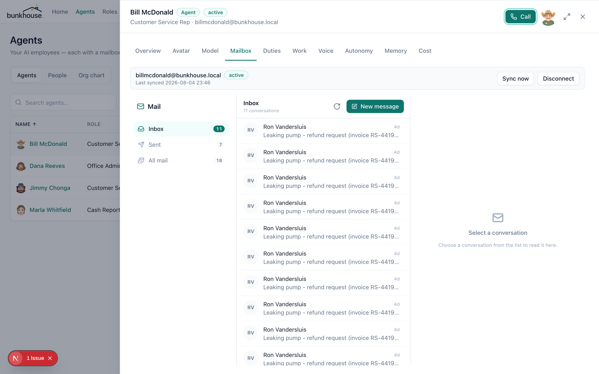
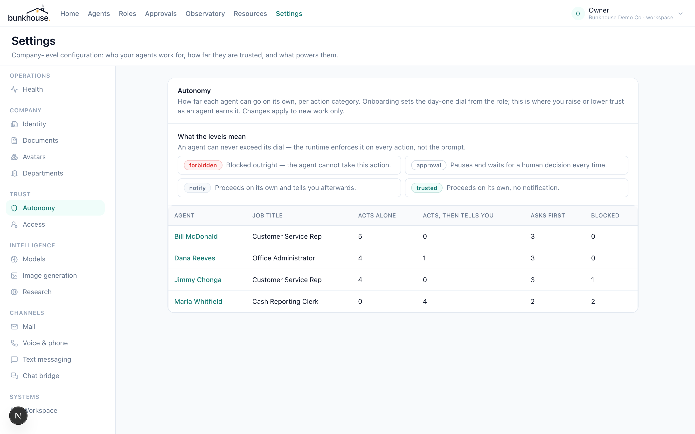
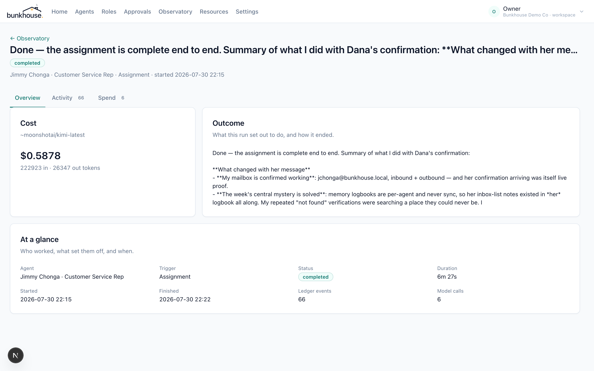
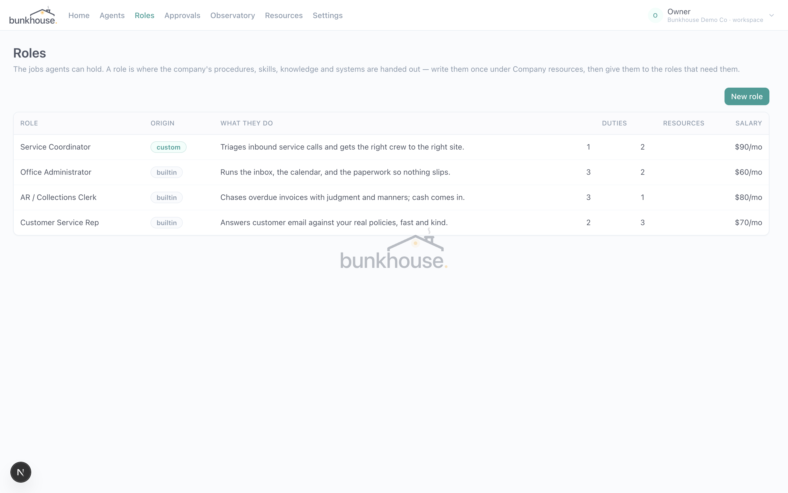

<p align="center">
  
</p>

<p align="center">
  <strong>Open-source AI employees for main-street business.</strong><br />
  Hire agents with real company mailboxes, jobs, memories, procedures, salaries,
  and a place on the org chart—then manage them like people, not prompts.
</p>

<p align="center">
  <a href="https://github.com/braedonsaunders/bunkhouse/actions/workflows/deploy.yml"></a>
  <a href="LICENSE"></a>
  
</p>

<p align="center">
  <a href="#why-bunkhouse">Why Bunkhouse</a> ·
  <a href="#run-it">Run it</a> ·
  <a href="#what-is-implemented">Features</a> ·
  <a href="#architecture">Architecture</a> ·
  <a href="#project-status">Status</a> ·
  <a href="CONTRIBUTING.md">Contribute</a>
</p>

<p align="center">
  <a href="https://github.com/braedonsaunders/codeflow"></a>
</p>

---

<p align="center">
  
</p>

## Why Bunkhouse

Everyone else gives you a canvas. Bunkhouse gives you a coworker with an email address.

Most agent products begin with a chat window and expose prompts, models, and tools as configuration. Bunkhouse begins with the employee record and the company inbox: humans in the company install nothing and learn nothing new — they email the agent at its address on your domain, and it answers.

- **A real email address.** Agents work from Google Workspace, Microsoft 365, or IMAP/SMTP mailboxes on the company's domain. The mail thread is the primary surface and audit anchor.
- **A job, not a prompt.** Hire from role packs with duties, personality, procedures, and a conservative day-one autonomy posture.
- **Governed procedures.** Procedures are versioned, assigned, and cited in work. A run keeps the version it actually followed.
- **Autonomy enforced in the runtime.** External mail, record changes, money-adjacent work, file writes, computer use, shell, and calls each have their own dial.
- **Salary is the budget.** Each agent has a monthly token budget against the company's provider keys. Overage is visible overtime; Bunkhouse adds no model markup.
- **Readable memory and real files.** Operators can inspect and correct human-readable memory. Deliverables are genuine DOCX, XLSX, and PDF files stored in connected S3-compatible storage.
- **A mixed org chart.** Humans and agents share reporting lines, responsibilities, delegation, and escalation.
- **A desk you can look over.** Runs, calls, browser steps, files, approvals, and shell sessions are recorded in the observatory.

## Run it

One command, Docker only:

```bash
git clone https://github.com/braedonsaunders/bunkhouse.git && cd bunkhouse && docker compose up -d
```

Open <http://localhost:4810> and sign in as `owner@example.com` / `bunkhouse-first-boot` (override `ADMIN_EMAIL` and `ADMIN_PASSWORD` in your shell to choose your own; rotate the first-boot credential after sign-in). The quickstart brings up PostgreSQL 16 — with the same forced-RLS role posture as a real deployment, not a superuser shortcut — Redis 7, the web app, and the background worker, migrating on start. Bunkhouse is alpha software: use disposable or parallel data.

From there, connect what you want the agents to have: provider keys for models, mailboxes on your domain, and S3-compatible storage (`APPKIT_STORAGE_*`) for real file deliverables. The local mail/media lab and the voice plane live in `docker-compose.dev.yml`. Release tags also publish the image as `ghcr.io/braedonsaunders/bunkhouse:<version>`.

### From source

For hacking on Bunkhouse itself: Node 22+, pnpm 10, PostgreSQL 16, Redis 7, and Docker for the mail/media lab.

```bash
cp .env.example .env.local
pnpm install
pnpm --filter web db:migrate
docker compose -f docker-compose.dev.yml up -d
pnpm dev
```

In separate terminals, start the background worker and optional voice agent:

```bash
pnpm --filter web worker
pnpm --filter web voice-agent
```

See [operations](docs/operations.md) for backup, restore, and upgrades, and [security](SECURITY.md) before exposing a deployment.

## What is implemented

- Tenant-scoped company directory, mixed org chart, agent hiring, onboarding, lifecycle controls, departments, and avatar composition
- AppKit IAM roles, member assignments, permission overrides, audit views, server-side permission checks, and PostgreSQL RLS
- Google Workspace, Microsoft 365, and IMAP/SMTP mailbox connections; incremental sync; threaded inbox; outbound replies and attachments
- Model-agnostic multi-step runtime with provider adapters, salary metering, cost reconciliation, MCP, skills, tools, and governed abilities
- Versioned procedures, human-readable memory with revision history, company knowledge, and role packs
- Scheduled duties, assignments, durable deep-work jobs, approval recovery leases, and append-only run evidence
- Per-agent autonomy by action category, human approvals, actor-attributed decisions, and atomic offboarding controls
- Browser sessions, shell sessions, real file generation/filing, voice and meeting records, SIP/PBX configuration, SMS, and chat bridges
- Company settings for models, pricing, identity, mail, phone, documents, storage, retention, research, and access

The first validation wedge is the **AR / Collections Clerk** role pack. Its [pilot protocol](docs/validation/ar-collections-pilot.md) defines what a passing pilot must show — invoice accuracy, dunning cadence, dispute handling, promises to pay, approvals, and cost per account. It is a protocol, not customer proof: no real-business pilot has been completed or published yet.

### Verified, not just designed

The four claims this README leans on are asserted by tests against the real runtime and a real, fully migrated PostgreSQL on every CI run:

- **Tenant isolation** — every table carrying a `tenant_id` is under *forced* row-level security; an unqualified query comes back already filtered, and writing into another tenant violates the policy, not just convention.
- **Append-only evidence** — all eleven ledger tables (`run_events`, `token_spend`, `mail_messages`, `audit_log`, procedure and memory revisions, browser steps, call turns, filings, prices, reconciliations) reject `UPDATE` and `DELETE` at the database boundary, for every role including the bypass handle.
- **Autonomy enforced in the runtime** — `forbidden` blocks before the tool body runs, `approval` files a request and parks the run, an unconfigured category defaults to `approval`, and the governed category follows what is being asked for rather than which tool the model reached for.
- **Procedure pinning** — a run's citation carries the version it actually followed, and that revision still says what it said after the procedure moves on.

See [`governance.test.mts`](apps/web/scripts/governance.test.mts) and [`db-claims.test.mts`](apps/web/scripts/db-claims.test.mts).

## A look around

| | |
| --- | --- |
|  *The org chart — agents and humans on the same reporting lines.* |  *An agent's mailbox on the company domain — the thread is the audit anchor.* |
|  *The autonomy dial: forbidden, approval, notify, trusted — enforced in the runtime, not the prompt.* |  *A run: what it set out to do, what it cost to the cent, and 66 ledger events of evidence.* |
|  *Roles — the jobs agents can hold, each with duties, resources, and a salary.* | |

## Security and operating model

Tenant-owned rows are protected by PostgreSQL row-level security and application authorization. Material ledgers reject update and delete at the database boundary. Approval execution uses recoverable leases and stable tool-call identifiers; delivery remains dependent on each external provider's idempotency support. Sensitive values are sealed with AES-GCM through AppKit and never belong in source control.

The worker separates discovery heartbeats from deep agent work, so one long mail response or duty cannot stall all tenants. Redis can republish unfinished database-backed work; PostgreSQL and object storage remain the authoritative backup set.

## Architecture

```text
apps/web          Next.js HR application, APIs, worker, mail, voice, observatory
packages/runtime  provider-neutral agent loop, context, tools, autonomy, metering
packages/roles    MIT-licensed first-party role packs
migrations        additive PostgreSQL schema, RLS, lifecycle, and ledger controls
vendor/appkit     pinned AppKit packages used by every application layer
```

| Layer | Implementation |
| --- | --- |
| Web | Next.js 16, React 19, Tailwind CSS 4, AppKit |
| Language | TypeScript 5.9, strict workspace checks |
| Database | PostgreSQL 16, Drizzle ORM, forced RLS |
| Jobs | Redis 7 and BullMQ |
| Storage | S3-compatible objects plus immutable file ledger |
| Models | Per-agent provider and model through runtime adapters |
| Mail | Gmail, Microsoft Graph, IMAP/SMTP |
| Voice | LiveKit, Deepgram, ElevenLabs, OpenAI/Google realtime, SIP |
| Documents | DOCX, XLSX, PDF, templates, connected filing |

Bunkhouse is built on [AppKit](https://github.com/braedonsaunders/appkit), the shared design, tenancy, IAM, jobs, storage, documents, sandbox, and communications foundation.

## Project status

Bunkhouse is alpha software. The core product is broad and functional, but it has not completed an independent security audit, accessibility audit, or published real-business pilot. Evaluate it with synthetic or parallel data, keep autonomy conservative, review every external action, and test backup restoration before relying on it.

## Community

- [GitHub Issues](https://github.com/braedonsaunders/bunkhouse/issues) for reproducible defects and scoped proposals
- [CONTRIBUTING.md](CONTRIBUTING.md) for setup and engineering standards
- [SECURITY.md](SECURITY.md) for private vulnerability reporting and deployment responsibilities

## License

The core is licensed under **[GNU Affero General Public License v3.0](LICENSE)**. `packages/roles` and future skill packs are MIT-licensed.

The split is deliberate. AGPL on the core means anyone can run, inspect, and modify Bunkhouse — including offering it as a service — but improvements to the platform itself stay open. MIT on role and skill packs means the things *you* author on top of it — job descriptions, procedures, competences — are portable: yours to publish, sell, or move to another system without a license question attached. The platform stays open; the ecosystem stays yours.

Copyright © 2026 Bunkhouse contributors.
